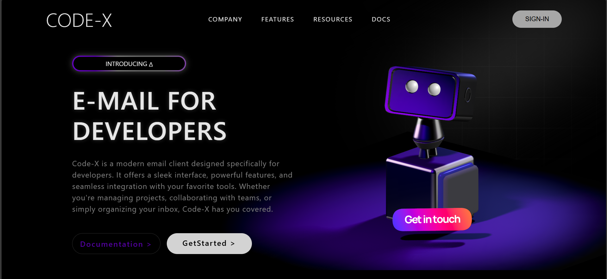

# 3D Web: CODE-X

Welcome to **CODE-X**, a modern 3D web landing page designed for developers! This project demonstrates a visually stunning interface with interactive 3D elements, built using HTML, CSS, and Spline.

## Features

  - Clean, modern layout with responsive design for desktop, tablet, and mobile.
  - Animated gradient backgrounds and blur effects for a futuristic look.
  - A 3D robot is embedded using [Spline](https://spline.design/), adding a dynamic and engaging element to the page.
  - The robot responds to your cursor movements, creating an interactive experience for users.
  - Gradient-animated tag introducing the product.
  - Stylish call-to-action buttons for documentation and getting started.
  - Optimized for all screen sizes, ensuring a seamless experience on any device.

## 3D Robot with Spline

The 3D robot is integrated using the `<spline-viewer>` web component, which loads a Spline scene directly into the page. The robot is interactive and responds to your cursor, making the landing page lively and engaging.

```
<spline-viewer class="robot" url="https://prod.spline.design/6PCGynvuzkpOZlN8/scene.splinecode"></spline-viewer>
```

## Screenshots

### Main Interface


### Demo Video
https://user-images.githubusercontent.com/your-username/your-repo-name/screenrecording.mp4

Or view the video below:


## Getting Started

1. Clone the repository:
   ```sh
   git clone https://github.com/xthunder91/interactive-3d-website.git
   ```
2. Open `index.html` in your browser.

No build steps required—just open and explore!


**Made with ❤️ for developers.**
